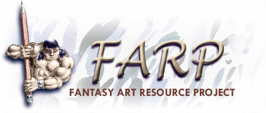

# FARP Writing Archive

[Elfwood](https://en.wikipedia.org/wiki/Elfwood) was a popular web-based alternative art gallery and online community devoted to original science fiction and fantasy art and writing. Elfwood had a FARP section, which stood for Fantasy Art Resource Project. 

In this repository, I have archived all posts from the Writing Tutorials section. 

Since Elfwood had been around for a while, the styling of these tutorials were all over the place, so it was also necessary to properly format each tutorial as well: each tutorial can be found as Markdown.

The basis for the archival is [this snapshot](https://web.archive.org/web/20110723091424/http://www.elfwood.com/farp/writing-tutorials.html) from archive.org.

## Contents

### General Writing

* [Description, Dialogue and Action](./01-general-writing/01-description-dialogue-and-action.md) by Jessica Barnes
* [Acquiring Feedback](./01-general-writing/02-acquiring-feedback.md) by Rachel sharon edidin
* [The Deception of Description](./01-general-writing/03-the-deception-of-description.md) by Erin M. Evans
* [Breaking Your Mental Blockers](./01-general-writing/04-breaking-your-mental-blockers.md) by Nfoster
* [Originality in Fantasy](./01-general-writing/05-originality-in-fantasy.md) by A.R. George
* [Writing in English as a Foreign Language](./01-general-writing/06-writing-in-english-as-a-foreign-language.md) by Inger Marie Hognestad
* [Writing Action Scenes](./01-general-writing/07-writing-action-scenes.md) by S. B. 'Kinko' Hulsey
* [Narration on Narration](./01-general-writing/08-narration-on-narration.md) by Melheim
* [Developing a Strong Authorial Voice](./01-general-writing/09-developing-a-strong-authorial-voice.md) by Nicholas

## Disclaimer

The collection of art and writing tutorials in the Elfwood Fantasy Art Resource (F.A.R.P.) is a part of Elfwood.

All rights reserved to the original authors of the posts. The FARP logo was created by Miguel Krippahl and Thomas F. Abrahamsson. 

Those sections written by volunteers are copyrighted to Thomas Abrahamsson and the respective writers.